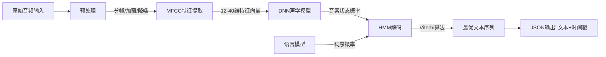

# 自动语音识别(ASR)与语音合成（TTS)解决方案

## 1 语音识别技术原理

以 Vosk 为例：

## 2 常见语音识别库

| 特性         | Whisper (OpenAI)    | Vosk (Alpha Cephei) | DeepSpeech (Mozilla)   | Flashlight (Meta)   | PaddleSpeech (百度)     | Athena (华为)       | TensorFlow ASR     |
| ---------- | ------------------- | ------------------- | ---------------------- | ------------------- | --------------------- | ----------------- | ------------------ |
| **模型架构**   | Transformer 编码器-解码器 | DNN-HMM (Kaldi 优化)  | RNN (CTC 损失)           | Transformer/RNN-T   | Transformer/Conformer | Transformer/RNN-T | RNN/Transformer    |
| **语言支持**   | 99+ 种语言             | 20+ 种语言             | 主要英语（需微调扩展）            | 多语言（需自定义训练）         | 中英为主，支持多语言            | 中英为主              | 需自定义训练             |
| **离线能力**   | ✅ 完全离线              | ✅ 完全离线              | ✅ 完全离线                 | ✅ 完全离线              | ✅ 完全离线                | ✅ 完全离线            | ✅ 需手动部署            |
| **预训练数据**  | 68 万小时（有监督）         | 依赖 Kaldi 数据集        | 1,000+ 小时（LibriSpeech） | 需自备数据               | 10,000+ 小时（中英）        | 未公开               | 需自备数据              |
| **典型 WER** | ~2.7% (LibriSpeech) | ~5-10% (依赖模型大小)     | ~6.5% (LibriSpeech)    | ~4.8% (LibriSpeech) | ~5.2% (AISHELL-1)     | ~4.5% (内部测试)      | 依赖模型配置             |
| **实时流式识别** | ❌ 需分段处理             | ✅ 支持                | ✅ 支持                   | ✅ 支持                | ✅ 支持                  | ✅ 支持              | ❌ 需自定义实现           |
| **部署复杂度**  | 中等（需 GPU 加速）        | 低（轻量级，支持嵌入式）        | 中等（依赖 TensorFlow）      | 高（需 C++/CUDA 编译）    | 中等（依赖 PaddlePaddle）   | 高（依赖 MindSpore）   | 高（需 TensorFlow 生态） |
| **推荐场景**   | 高精度多语言转录            | 嵌入式/低延迟应用           | 英语场景（历史项目）             | 研究/定制化模型            | 中文场景/工业应用             | 企业级中文场景           | 学术研究/实验性项目         |

## 3 FastWhisper

参考：https://github.com/SYSTRAN/faster-whisper

## 4 语音合成技术原理

主要有三种实现：
+ 拼接合成（Concatenative Synthesis）
+ 参数合成（Parametric Synthesis）
+ 基于深度学习的端到端合成（Neural TTS）

现在基于深度学习的端到端合成称为技术主流。

## 5 常见语音合成库

AI 生成仅供参考：

| 项目              | 音色相似度    | 多语言支持   | 推理速度         | 核心优势      | 推荐场景      |
| --------------- | -------- | ------- | ------------ | --------- | --------- |
| **Index-TTS**   | 高        | 中文优先    | 中等           | 拼音校正、精准停顿 | 技术文档播报    |
| **CosyVoice2**  | 极高（90%+） | 中英日韩+方言 | 流式极快         | 情感控制、低延迟  | 实时交互、虚拟助手 |
| **F5-TTS**      | 高        | 中英      | 极快（RTF 0.15） | 商用友好、快速推理 | 直播配音      |
| **Fish-Speech** | 中等       | 8种语言    | 较慢           | 无音素依赖     | 多语言播报     |
| **EmotiVoice**  | 高        | 中英      | 中等           | 情感合成、音色多样 | 影视配音、教育   |
| **PP-TTS**      | 高        | 中文优化    | 流式极快         | 端到端流式、低延迟 | 数字人、实时客服  |
一些功能需求：
+ 语音克隆
+ 低数据依赖
+ 高自然度
+ 个性化、情感化

## 6 CosyVoice

cosyvoice 官方没有发布到 PyPI 仓库，但是有人做了(Fork了一个仓库，添加了 setup.py，参考: [lucasjinreal/CosyVoice](https://github.com/lucasjinreal/CosyVoice)，好像还做了些封装，不过相对官方已经好久没更新了，不支持 CosyVoice2-0.5B 模型)， 所以搜索 cosyvoice 可以找到依赖，但是不太靠谱，执行报模块缺失。

可能官方想着实际应用时不会以这种嵌入式的方式执行，所以仅仅提供了 Web 执行方式，没有发布为依赖包。像 index-tts 同样没有发布到 PyPI, 但是index-tts 为了测试方便提供了 setup.py 可以安装为依赖包。

### 6.1 流式输入与流式输出

用于实时聊天场景，比如大模型流式出的文本，流式输入到 CosyVoice，然后逐个chunk生成语音并流式输出播放。

## 7 模型下载

做 ASR 和 TTS 也需要下载模型文件，推荐从 [ModelScope](https://modelscope.cn/models)（国内网站）下载。

## 8 参考

+ [13个最佳开源语音识别引擎](https://mp.weixin.qq.com/s?__biz=MzIyNTA3NDY2NQ==&mid=2247486525&idx=1&sn=b70abbf961f51b6af328586700b7d46b&chksm=e80400bbdf7389ad6addd19bcf883d311e1c80f27dc39e0c95a86f74e51fc0c496e6e938c3d2&mpshare=1&scene=23&srcid=0108ichMPEPiwhltjjxR2pGz&sharer_shareinfo=b414790a0cb2756e950f22c6c08f92bc&sharer_shareinfo_first=b414790a0cb2756e950f22c6c08f92bc&poc_token=HLYORWij5Qhf66ameQMgA0f3DanZAAeX-gjsZKA1)
